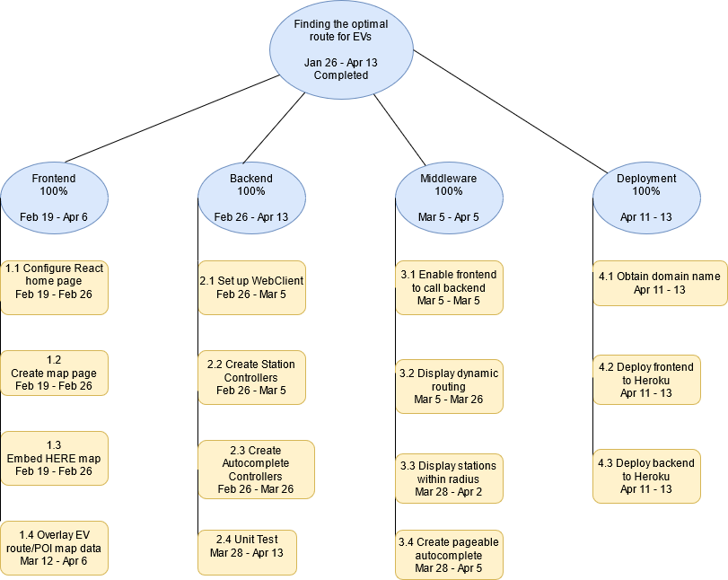
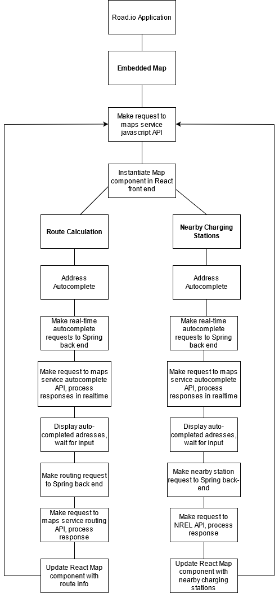
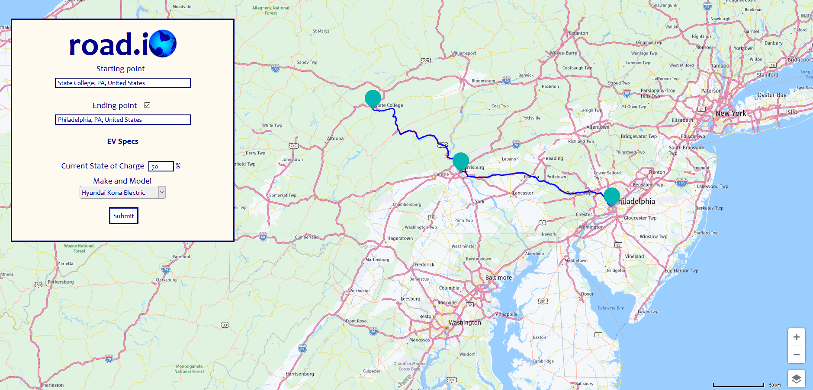
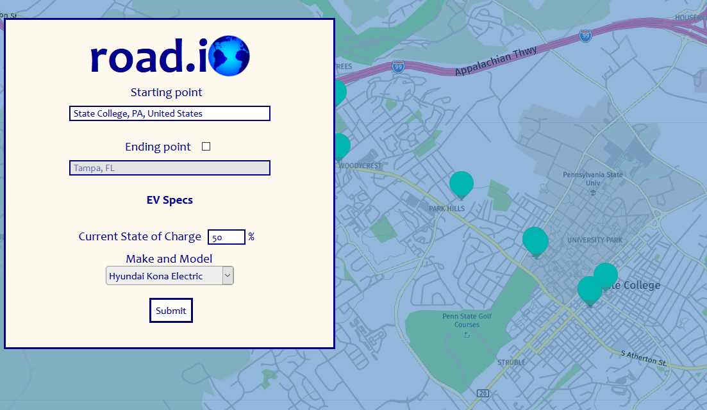
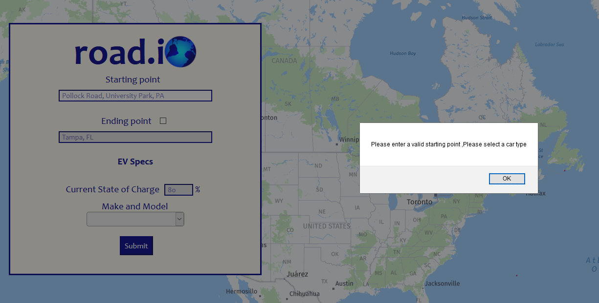

# Road.io
Senior Capstone Project Final Deliverable
Exists as a [Client](http://github.com/connellboyce/road.io-client) and [Server](http://github.com/connellboyce/road.io-server) application.
- For specific documentation on the client and server applications, visit their respective repositories.
  

## Table of Contents
1. [Team Members](#team-members)
2. [Course Information](#course-information)
2. [Gantt Chart](#gantt-chart)
3. [Work Breakdown Structure](#work-breakdown-structure)
4. [Functional Decomposition](#functional-decomposition)
5. [Application Snapshots](#application-snapshots)
6. [Project Report](#project-report)
7. [Team Presentation](#team-presentation)
  

## Team Members
- [Connell Boyce](https://github.com/connellboyce) - Senior, Information Sciences and Technology: Design and Development Option
- [Kellia Cockerill](https://github.com/kelliacockerill) - Senior, Information Sciences and Technology: Design and Development Option
- [Caden Martz](https://github.com/CadenRM) - Senior, Information Sciences and Technology: Design and Development Option
  

## Course Information
##### Pennsylvania State University   College of Information Sciences and Technology   Course Name: IST 440W   Instructor:  Kaamran Raahemifar   Semester: Spring 2021
 

## Gantt Chart
##### The following diagram illustrates the Gantt chart for the development of Road.io
  

## Work Breakdown Structure
##### The following diagram illustrates the work breakdown structure of Road.io

  

## Functional Decomposition
##### The following diagram illustrates the functional decomposition of Road.io

  

## Application Snapshots
##### Landing Page

  
##### Long-Distance Routing Feature

  
##### Finding Local Stations

  
##### Input Validation

  

## Project Report

## Team Presentation
